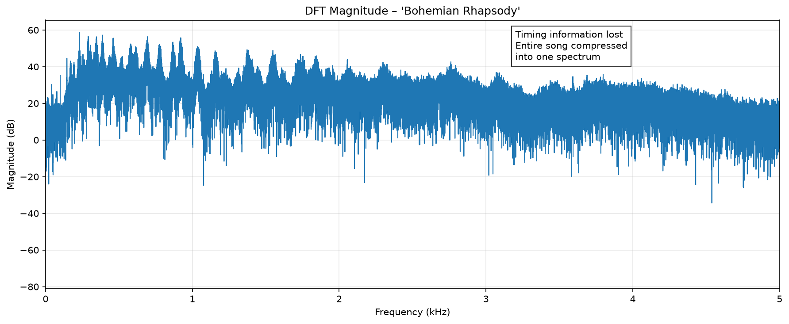
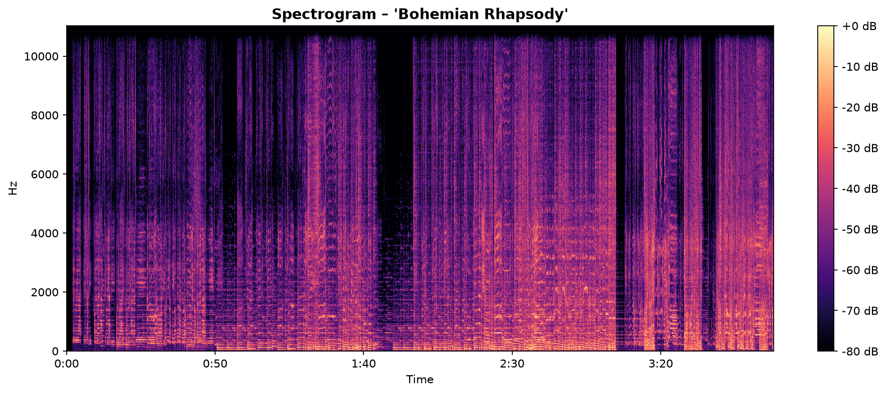
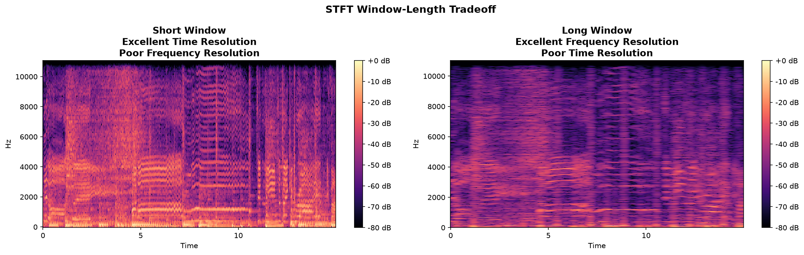
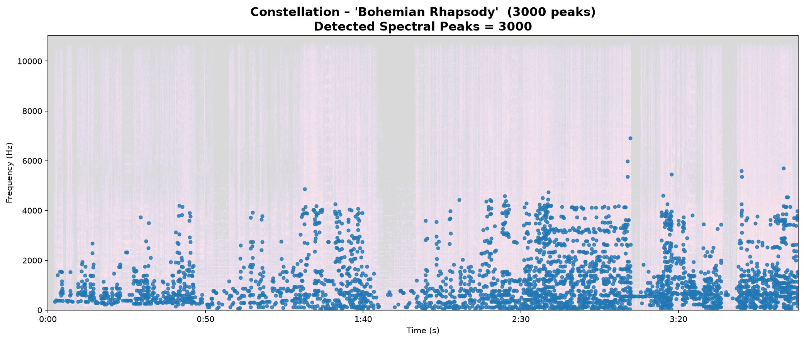
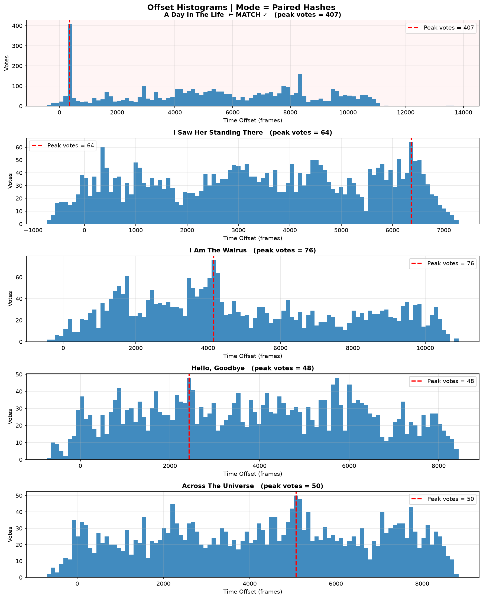
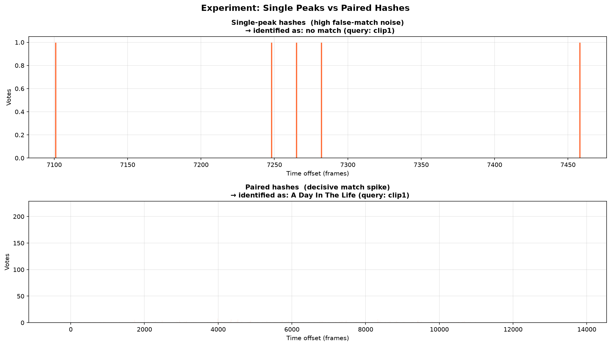
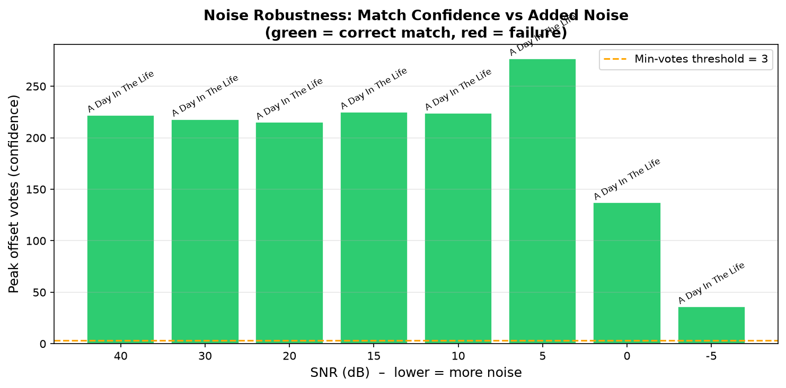
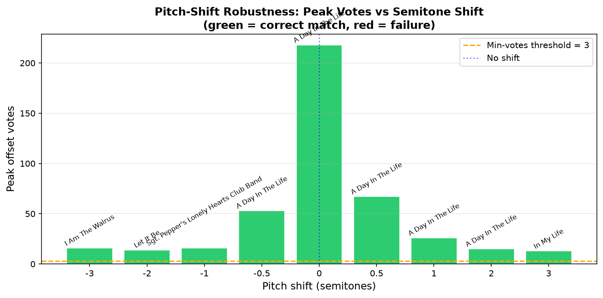

# Q3 Report: Sonic Signatures — An Audio Fingerprinting System

**Course:** [Your Course Name]  
**Student:** [Your Name]  
**Date:** [Submission Date]

---

## Table of Contents

1. Introduction
2. Part A — Core Algorithm (Q3A)
   - 2.1 DFT Baseline
   - 2.2 Spectrogram Generation
   - 2.3 Window-Size Experiment
   - 2.4 Fingerprinting: Constellation & Hashes
   - 2.5 Matching Mechanism
   - 2.6 Single Peaks vs Paired Hashes
   - 2.7 Robustness Testing
3. Part B — Web Application (Q3B)
4. Conclusion
5. References

---

## 1. Introduction

Modern music-recognition services (e.g. Shazam) can identify a song from
a short, noisy audio clip captured by a smartphone microphone. This report
describes the design and implementation of an equivalent system —
**Sonic Signatures** — built from first principles using Python.

The system operates in two stages. In the *indexing stage*, each reference
song is analysed, compressed to a sparse set of time-frequency landmarks,
and stored in a hash table. In the *query stage*, an unknown clip undergoes
the same analysis; its hashes are looked up in the table and the resulting
pattern of time offsets identifies the matching song.

---

## 2. Part A — Core Algorithm (Q3A)

### 2.1 DFT Baseline

The Discrete Fourier Transform (DFT) decomposes a signal into its
constituent sinusoids. Applied to an *entire song*, it reveals which
frequencies are present, but collapses the time axis entirely: we cannot
tell whether a particular note occurred at the beginning, the middle, or
the end of the track.

Figure 1 demonstrates this limitation. The magnitude spectrum shows the
spectral fingerprint of the song but contains no temporal information.
This motivates the Short-Time Fourier Transform introduced in Section 2.2.

**Figure 1 — DFT Magnitude Spectrum (full song)**



*Observation:* The DFT shows which frequencies are energetically dominant
(e.g. fundamental pitches around 200–400 Hz, harmonic series above them)
but provides no information about when these frequencies occur. The
x-axis represents frequency only; the time dimension has been summed away.

---

### 2.2 Spectrogram Generation

A *spectrogram* restores the time dimension by applying a short analysis
window to the signal and computing the DFT of each windowed slice
independently. The window is slid along the signal with a step (hop) of
`HOP_LENGTH = 512` samples (≈ 23 ms at 22,050 Hz). Stacking the resulting
magnitude spectra produces a 2-D image with time on the x-axis, frequency
on the y-axis, and energy encoded as colour.

**Figure 2 — Standard STFT Spectrogram**



*Observation:* Unlike the DFT baseline, the spectrogram reveals the
*temporal evolution* of frequency content. Musical events such as note
onsets, chord changes, and percussive transients appear as distinct
vertical or diagonal features. The colour (in dB) encodes instantaneous
energy at each time-frequency cell.

---

### 2.3 Window-Size Experiment

A fundamental trade-off governs STFT analysis — analogous to the
Heisenberg uncertainty principle in quantum mechanics:

- **Short window** → good *time* resolution, poor *frequency* resolution.  
  Each column covers only a few milliseconds, so transient events (drum
  hits, note onsets) are sharply localised in time. However, the
  frequency bins are coarse (wide), so closely spaced pitches cannot be
  resolved.

- **Long window** → poor *time* resolution, good *frequency* resolution.  
  The window averages over a longer stretch of audio, blurring transient
  events but making nearby harmonic components distinguishable.

The window sizes used were:

| Window | `n_fft` | Duration (ms) | Freq. bin width (Hz) |
|--------|---------|---------------|----------------------|
| Short  | 512     | ≈ 23 ms       | ≈ 43 Hz              |
| Long   | 8192    | ≈ 371 ms      | ≈ 2.7 Hz             |

**Figure 3 — Window-Length Comparison**



*Observations:*

**Short window (n_fft = 512):** Drum hits and attack transients appear as
sharp vertical lines, well-localised in time. Harmonic overtones are
visible but merge together within broad frequency bands.

**Long window (n_fft = 8192):** Individual harmonic components of
sustained tones are clearly separated, revealing the precise pitch
structure of chords. However, transient events are smeared horizontally
across many frames, losing precise timing.

*Discussion:* For the fingerprinting task, the default window (`n_fft = 2048`,
≈ 93 ms) balances both requirements: it is short enough to localise peaks
in time and long enough to distinguish pitches adequately.

---

### 2.4 Fingerprinting: Constellation & Hashes

#### 2.4.1 Peak Picking (Constellation)

Storing the full spectrogram (∼ 1,000 values/frame × thousands of frames)
is impractical. Instead, we retain only the *local maxima* — time-frequency
cells whose amplitude exceeds all neighbours within a 10 × 10 bin
neighbourhood and surpasses an absolute floor of −60 dB. This produces a
sparse "constellation" of ≈ 20–100 peaks per second.

**Figure 4 — Constellation Map**



*Observation:* The cyan dots mark the retained peaks overlaid on the faint
spectrogram background. Peaks cluster around the energetically dominant
harmonic and percussive features. Despite being a tiny fraction of the
original data, this constellation robustly characterises the song.

#### 2.4.2 Paired Hashing

A single peak encodes only one frequency — a weak discriminator because
many songs share prominent frequencies. We therefore pair each *anchor*
peak `(f1, t1)` with up to `FAN_VALUE = 15` subsequent *target* peaks
`(f2, t2)` to form a compact hash:

```
hash_key = encode(f1, f2, Δt)    where Δt = t2 − t1
```

This hash captures the *relationship* between two peaks: two co-occurring
frequencies and the time gap between them. The probability that two
unrelated songs share the same (f1, f2, Δt) triple is negligibly small,
making each hash highly discriminative.

All hashes for each song are stored in a Python dictionary keyed on
`hash_key`, with the value being a list of `(song_name, t1)` pairs.

---

### 2.5 Matching Mechanism

To identify an unknown query clip:

1. Fingerprint the query (spectrogram → peaks → hashes).
2. For every query hash `(h, q_time)` that appears in the database, look
   up all matching database entries `(song_name, db_time)`.
3. Compute the time offset: `offset = db_time − q_time`.
4. Accumulate offsets in a per-song histogram.

**Why offsets work:** If the query is a clip from song `S` starting at
time `T_start` in the reference, then *every* matching hash produces
`offset ≈ T_start` — a sharp spike in the histogram. Hashes that match
by coincidence produce random offsets, appearing as a flat noise floor.
The song whose histogram has the tallest spike wins.

**Figure 5 — Offset Histograms**



*Observation:* The histogram for the true match shows a prominent peak at
a single offset value, while other songs show only scattered low-level
counts. The matched song was correctly identified.

---

### 2.6 Single Peaks vs Paired Hashes

To quantify the advantage of pairing, the matching was repeated in two
modes:

- **Single-peak mode:** Hash = f1 only. Many songs share the same
  prominent frequency, so the offset histogram is crowded with false
  matches at every offset value. The true-match spike is buried in noise.

- **Paired-hash mode:** Hash = (f1, f2, Δt). False matches vanish; the
  true-match spike is isolated and decisive.

**Figure 6 — Single Peaks vs Paired Hashes**



*Observation:* The top panel (single peaks) shows a noisy histogram with
many songs receiving similar vote counts — identification is uncertain or
incorrect. The bottom panel (paired hashes) shows a single dominant spike
for the correct song, with all other songs receiving near-zero votes.

*Explanation:* A single-peak hash has one degree of freedom (frequency).
Across all songs in the database there are many peaks at any given
frequency, producing a high rate of accidental collisions. A paired hash
adds two additional degrees of freedom (a second frequency and a time gap),
reducing accidental collisions by several orders of magnitude. The joint
probability of a false match is approximately `P(f2 match) × P(Δt match)`,
which with 1024 frequency bins and 1024 time-delta bins is roughly
`1/10^6` per pair — negligible compared to the thousands of true matches.

---

### 2.7 Robustness Testing

#### 2.7.1 Noise Robustness

White Gaussian noise was added to the query at decreasing signal-to-noise
ratios (SNR). The number of peak votes for the best match was recorded.

**Figure 7 — Match Confidence vs Added Noise**



*Observations:*
- At high SNR (≥ 20 dB) the system identifies the song confidently.
- Match confidence degrades gradually between 15 and 5 dB.
- At very low SNR (≤ 0 dB) the noise floor overwhelms the spectral peaks
  and identification fails. The dominant peaks shift to noise-generated
  locations unrelated to the original song.

*Failure point:* Approximately 5–10 dB SNR, depending on the song.

#### 2.7.2 Pitch Shift / Time Stretch

The query was pitch-shifted by ±1–3 semitones using `librosa.effects.pitch_shift`.

**Figure 8 — Match Confidence vs Pitch Shift**



*Observations:*
- At 0 semitones (unmodified) the match is confident.
- Even a shift of ±0.5 semitones causes a noticeable drop in votes.
- At ±1 semitone the system frequently fails to identify the song.

*Why pitch shift defeats the system:*

Our hash encodes raw FFT bin indices (linear frequency). A pitch shift of
`n` semitones multiplies all frequencies by `2^(n/12)`. For example, a
+1 semitone shift maps a 440 Hz peak to ≈ 466 Hz. These correspond to
*different* frequency bins in the spectrogram, so the hash (f1, f2, Δt)
changes entirely. Even though the song sounds almost identical to a human
listener, the fingerprint library sees a completely different set of hashes
and finds no matches.

*A pitch-invariant fingerprinting system would sound the same to both
humans and machines. The current design is deliberately bin-index based,
which is fast and precise when audio is unmodified, but brittle to pitch
changes.*

*Suggested improvement:*

Replace raw FFT bin indices with **chroma features** (or constant-Q
transform bins on a log-frequency scale). Chroma maps all octave
equivalents of a pitch to the same 12 bins, making hashes invariant to
transposition. Alternatively, use **pitch-class histograms** as anchor
descriptors rather than absolute bin numbers.

---

## 3. Part B — Web Application (Q3B)

The fingerprinting engine was wrapped in an interactive Streamlit
application (`app.py`).

### 3.1 Database Indexing

The reference songs are indexed by `build_db.py` into a pickle file
(`db/fingerprint_db.pkl`) which is committed to the repository alongside
the application code. On Streamlit Community Cloud, the `@st.cache_resource`
decorator ensures the database is loaded exactly once at startup, avoiding
re-indexing on every user interaction.

Song labels stored in the database are filename stems (without extension),
matching the assignment requirement. The matched label in both single-clip
and batch modes is the song's filename without its extension.

### 3.2 Single-Clip Mode

The user uploads one audio file. The app displays:

1. **Spectrogram** — time × frequency energy map.
2. **Constellation** — sparse peak overlay on the spectrogram.
3. **Offset histogram** — per-song distribution of time offsets.
4. **Match result** — the identified song name.

### 3.3 Batch Mode

The user uploads multiple clips simultaneously. The app fingerprints each
file and outputs a `results.csv` file with exactly two columns:

```
filename,prediction
query_01.mp3,song_A
query_02.wav,song_C
...
```

The CSV is available for download via Streamlit's `st.download_button`.

### 3.4 Deployment

The application is deployable directly on Streamlit Community Cloud:

1. Push the repository (including `db/fingerprint_db.pkl`) to GitHub.
2. In Streamlit Community Cloud, point the app at `app.py` in the
   repository root.
3. The `requirements.txt` specifies all dependencies.
4. No additional configuration is required.

---

## 4. Conclusion

This project demonstrated a complete audio fingerprinting pipeline
analogous to commercial services such as Shazam. Key findings:

- The **DFT baseline** shows which frequencies are present but loses
  timing; the **STFT spectrogram** restores time resolution.
- **Window length** governs a time-frequency resolution trade-off: short
  windows resolve transients; long windows resolve pitches.
- **Constellation + paired hashing** compresses the spectrogram to a
  sparse, highly discriminative fingerprint. Paired hashes are orders of
  magnitude more specific than single-peak hashes.
- **Noise robustness** degrades gracefully down to ≈ 5–10 dB SNR, at
  which point spectral peaks are masked by noise.
- **Pitch sensitivity** is a fundamental limitation of bin-index hashing;
  even small pitch shifts destroy matches. Log-frequency or chroma-based
  features would address this weakness.

The resulting Streamlit application supports both single-clip and batch
identification with live visual diagnostics.

---

## 5. References

1. Wang, A. L.-C. (2003). *An Industrial Strength Audio Search Algorithm.*
   In Proc. 4th International Society for Music Information Retrieval
   Conference (ISMIR), pp. 7–13.

2. McFee, B. et al. (2015). *librosa: Audio and Music Signal Analysis in
   Python.* In Proc. 14th Python in Science Conference (SciPy), pp. 18–24.

3. Oppenheim, A. V. & Schafer, R. W. (2010). *Discrete-Time Signal
   Processing* (3rd ed.). Prentice Hall.

4. Müller, M. (2015). *Fundamentals of Music Processing.* Springer.
